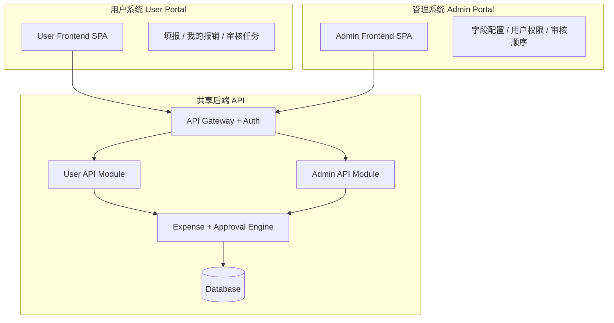

# 双系统总览

两个独立前端应用共用一套后端：**用户系统**负责 expense 生命周期；**Admin 系统**负责元数据配置（字段、权限、审核顺序），配置变更影响用户侧表单与审批路由。

```mermaid
flowchart TB
    subgraph UserSystem["用户系统 User Portal"]
        U_FE[User Frontend SPA]
        U_MOD[填报 / 我的报销 / 审核任务]
    end

    subgraph AdminSystem["管理系统 Admin Portal"]
        A_FE[Admin Frontend SPA]
        A_MOD[字段配置 / 用户权限 / 审核顺序]
    end

    subgraph Backend["共享后端 API"]
        GW[API Gateway + Auth]
        UM[User API Module]
        AM[Admin API Module]
        CORE[Expense + Approval Engine]
        DB[(Database)]
    end

    U_FE --> GW
    A_FE --> GW
    GW --> UM
    GW --> AM
    UM --> CORE
    AM --> CORE
    CORE --> DB
```
