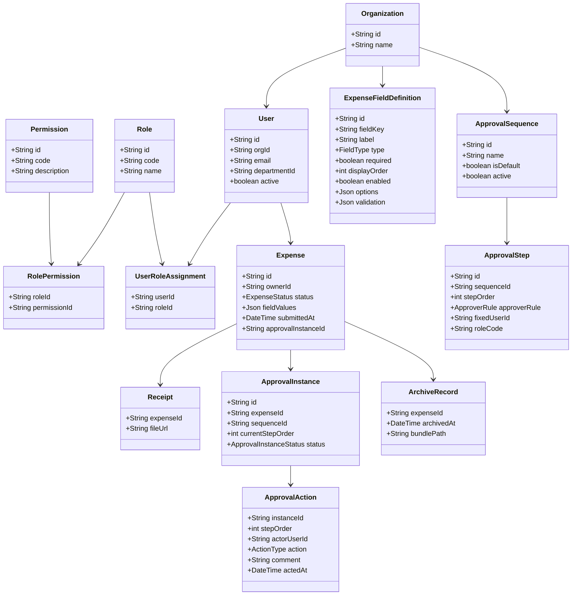

# 领域模型

核心仍为 **Expense**；Admin 可配置的三元组：`ExpenseFieldDefinition`（动态字段）、`Role`+`Permission`（权限）、`ApprovalSequence`+`ApprovalStep`（审核顺序）。

```mermaid
classDiagram
    direction TB

    class Organization {
        +String id
        +String name
    }

    class User {
        +String id
        +String orgId
        +String email
        +String departmentId
        +boolean active
    }

    class Role {
        +String id
        +String code
        +String name
    }

    class Permission {
        +String id
        +String code
        +String description
    }

    class RolePermission {
        +String roleId
        +String permissionId
    }

    class UserRoleAssignment {
        +String userId
        +String roleId
    }

    class ExpenseFieldDefinition {
        +String id
        +String fieldKey
        +String label
        +FieldType type
        +boolean required
        +int displayOrder
        +boolean enabled
        +Json options
        +Json validation
    }

    class Expense {
        +String id
        +String ownerId
        +ExpenseStatus status
        +Json fieldValues
        +DateTime submittedAt
        +String approvalInstanceId
    }

    class Receipt {
        +String expenseId
        +String fileUrl
    }

    class ApprovalSequence {
        +String id
        +String name
        +boolean isDefault
        +boolean active
    }

    class ApprovalStep {
        +String id
        +String sequenceId
        +int stepOrder
        +ApproverRule approverRule
        +String fixedUserId
        +String roleCode
    }

    class ApprovalInstance {
        +String id
        +String expenseId
        +String sequenceId
        +int currentStepOrder
        +ApprovalInstanceStatus status
    }

    class ApprovalAction {
        +String instanceId
        +int stepOrder
        +String actorUserId
        +ActionType action
        +String comment
        +DateTime actedAt
    }

    class ArchiveRecord {
        +String expenseId
        +DateTime archivedAt
        +String bundlePath
    }

    Organization --> User
    Role --> RolePermission
    Permission --> RolePermission
    User --> UserRoleAssignment
    Role --> UserRoleAssignment
    Organization --> ExpenseFieldDefinition
    Organization --> ApprovalSequence
    ApprovalSequence --> ApprovalStep
    User --> Expense
    Expense --> Receipt
    Expense --> ApprovalInstance
    ApprovalInstance --> ApprovalAction
    Expense --> ArchiveRecord
```
