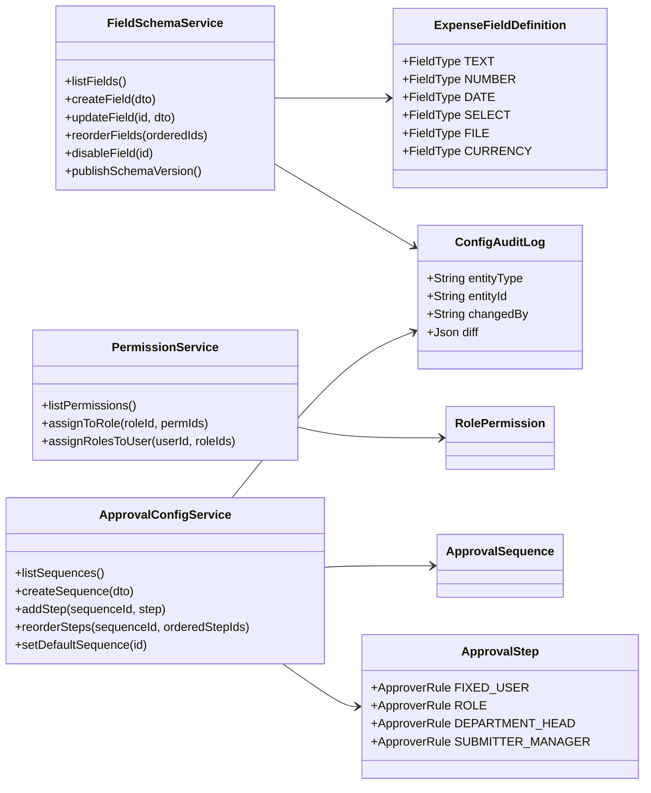

# Admin 配置模型

Admin 侧三类配置服务；每次发布字段 schema 或调整审核顺序写入 `ConfigAuditLog` 便于追溯。

```mermaid
classDiagram
    direction LR

    class FieldSchemaService {
        +listFields()
        +createField(dto)
        +updateField(id, dto)
        +reorderFields(orderedIds)
        +disableField(id)
        +publishSchemaVersion()
    }

    class ExpenseFieldDefinition {
        +FieldType TEXT
        +FieldType NUMBER
        +FieldType DATE
        +FieldType SELECT
        +FieldType FILE
        +FieldType CURRENCY
    }

    class PermissionService {
        +listPermissions()
        +assignToRole(roleId, permIds)
        +assignRolesToUser(userId, roleIds)
    }

    class ApprovalConfigService {
        +listSequences()
        +createSequence(dto)
        +addStep(sequenceId, step)
        +reorderSteps(sequenceId, orderedStepIds)
        +setDefaultSequence(id)
    }

    class ApprovalStep {
        +ApproverRule FIXED_USER
        +ApproverRule ROLE
        +ApproverRule DEPARTMENT_HEAD
        +ApproverRule SUBMITTER_MANAGER
    }

    class ConfigAuditLog {
        +String entityType
        +String entityId
        +String changedBy
        +Json diff
    }

    FieldSchemaService --> ExpenseFieldDefinition
    PermissionService --> RolePermission
    ApprovalConfigService --> ApprovalSequence
    ApprovalConfigService --> ApprovalStep
    FieldSchemaService --> ConfigAuditLog
    ApprovalConfigService --> ConfigAuditLog
```
