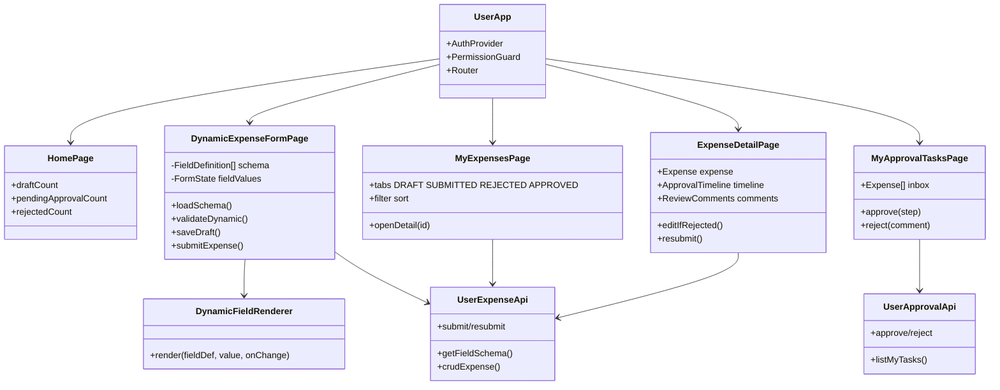

# 用户系统 · 前端

用户 SPA：根据 Admin 发布的 **field schema** 动态渲染表单；具备审批权限的用户在「我的审核任务」处理当前步骤。

```mermaid
classDiagram
    direction TB

    class UserApp {
        +AuthProvider
        +PermissionGuard
        +Router
    }

    class HomePage {
        +draftCount
        +pendingApprovalCount
        +rejectedCount
    }

    class DynamicExpenseFormPage {
        -FieldDefinition[] schema
        -FormState fieldValues
        +loadSchema()
        +validateDynamic()
        +saveDraft()
        +submitExpense()
    }

    class MyExpensesPage {
        +tabs DRAFT SUBMITTED REJECTED APPROVED
        +filter sort
        +openDetail(id)
    }

    class ExpenseDetailPage {
        +Expense expense
        +ApprovalTimeline timeline
        +ReviewComments comments
        +editIfRejected()
        +resubmit()
    }

    class MyApprovalTasksPage {
        +Expense[] inbox
        +approve(step)
        +reject(comment)
    }

    class DynamicFieldRenderer {
        +render(fieldDef, value, onChange)
    }

    class UserExpenseApi {
        +getFieldSchema()
        +crudExpense()
        +submit/resubmit
    }

    class UserApprovalApi {
        +listMyTasks()
        +approve/reject
    }

    UserApp --> HomePage
    UserApp --> DynamicExpenseFormPage
    UserApp --> MyExpensesPage
    UserApp --> ExpenseDetailPage
    UserApp --> MyApprovalTasksPage
    DynamicExpenseFormPage --> DynamicFieldRenderer
    DynamicExpenseFormPage --> UserExpenseApi
    MyExpensesPage --> UserExpenseApi
    ExpenseDetailPage --> UserExpenseApi
    MyApprovalTasksPage --> UserApprovalApi
```
