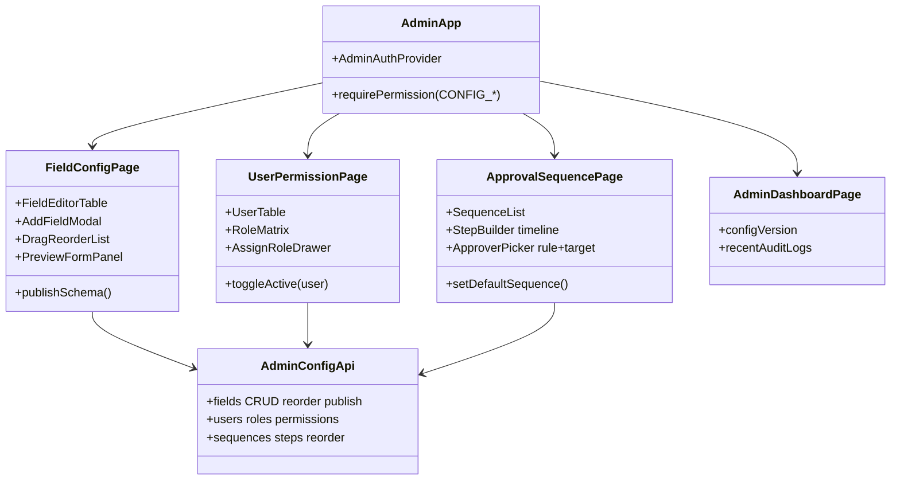

# Admin 系统 · 前端

Admin SPA 三大配置页：字段、用户权限、审核顺序；支持拖拽排序与表单预览。

```mermaid
classDiagram
    direction TB

    class AdminApp {
        +AdminAuthProvider
        +requirePermission(CONFIG_*)
    }

    class FieldConfigPage {
        +FieldEditorTable
        +AddFieldModal
        +DragReorderList
        +PreviewFormPanel
        +publishSchema()
    }

    class UserPermissionPage {
        +UserTable
        +RoleMatrix
        +AssignRoleDrawer
        +toggleActive(user)
    }

    class ApprovalSequencePage {
        +SequenceList
        +StepBuilder timeline
        +ApproverPicker rule+target
        +setDefaultSequence()
    }

    class AdminDashboardPage {
        +configVersion
        +recentAuditLogs
    }

    class AdminConfigApi {
        +fields CRUD reorder publish
        +users roles permissions
        +sequences steps reorder
    }

    AdminApp --> AdminDashboardPage
    AdminApp --> FieldConfigPage
    AdminApp --> UserPermissionPage
    AdminApp --> ApprovalSequencePage
    FieldConfigPage --> AdminConfigApi
    UserPermissionPage --> AdminConfigApi
    ApprovalSequencePage --> AdminConfigApi
```
