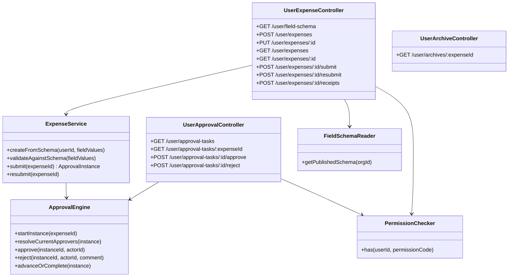

# 用户系统 · 后端 API

用户 API 前缀 `/user/*`；submit 时 `ApprovalEngine` 按 Admin 配置的 `ApprovalSequence` 创建实例并定位第一步审批人。

```mermaid
classDiagram
    direction TB

    class UserExpenseController {
        +GET /user/field-schema
        +POST /user/expenses
        +PUT /user/expenses/:id
        +GET /user/expenses
        +GET /user/expenses/:id
        +POST /user/expenses/:id/submit
        +POST /user/expenses/:id/resubmit
        +POST /user/expenses/:id/receipts
    }

    class UserApprovalController {
        +GET /user/approval-tasks
        +GET /user/approval-tasks/:expenseId
        +POST /user/approval-tasks/:id/approve
        +POST /user/approval-tasks/:id/reject
    }

    class UserArchiveController {
        +GET /user/archives/:expenseId
    }

    class ExpenseService {
        +createFromSchema(userId, fieldValues)
        +validateAgainstSchema(fieldValues)
        +submit(expenseId) ApprovalInstance
        +resubmit(expenseId)
    }

    class FieldSchemaReader {
        +getPublishedSchema(orgId)
    }

    class ApprovalEngine {
        +startInstance(expenseId)
        +resolveCurrentApprovers(instance)
        +approve(instanceId, actorId)
        +reject(instanceId, actorId, comment)
        +advanceOrComplete(instance)
    }

    class PermissionChecker {
        +has(userId, permissionCode)
    }

    UserExpenseController --> ExpenseService
    UserExpenseController --> FieldSchemaReader
    UserExpenseController --> PermissionChecker
    UserApprovalController --> ApprovalEngine
    UserApprovalController --> PermissionChecker
    ExpenseService --> ApprovalEngine
```
