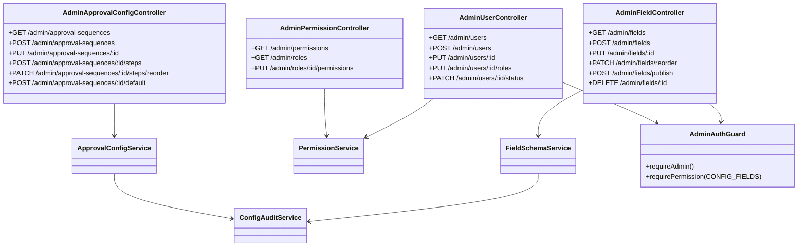

# Admin 系统 · 后端 API

Admin API 前缀 `/admin/*`；所有写操作需 `CONFIG_*` 权限并由 `ConfigAuditService` 记日志。

```mermaid
classDiagram
    direction TB

    class AdminFieldController {
        +GET /admin/fields
        +POST /admin/fields
        +PUT /admin/fields/:id
        +PATCH /admin/fields/reorder
        +POST /admin/fields/publish
        +DELETE /admin/fields/:id
    }

    class AdminUserController {
        +GET /admin/users
        +POST /admin/users
        +PUT /admin/users/:id
        +PUT /admin/users/:id/roles
        +PATCH /admin/users/:id/status
    }

    class AdminPermissionController {
        +GET /admin/permissions
        +GET /admin/roles
        +PUT /admin/roles/:id/permissions
    }

    class AdminApprovalConfigController {
        +GET /admin/approval-sequences
        +POST /admin/approval-sequences
        +PUT /admin/approval-sequences/:id
        +POST /admin/approval-sequences/:id/steps
        +PATCH /admin/approval-sequences/:id/steps/reorder
        +POST /admin/approval-sequences/:id/default
    }

    class FieldSchemaService
    class PermissionService
    class ApprovalConfigService
    class ConfigAuditService

    class AdminAuthGuard {
        +requireAdmin()
        +requirePermission(CONFIG_FIELDS)
    }

    AdminFieldController --> FieldSchemaService
    AdminUserController --> PermissionService
    AdminPermissionController --> PermissionService
    AdminApprovalConfigController --> ApprovalConfigService
    AdminFieldController --> AdminAuthGuard
    AdminUserController --> AdminAuthGuard
    FieldSchemaService --> ConfigAuditService
    ApprovalConfigService --> ConfigAuditService
```
