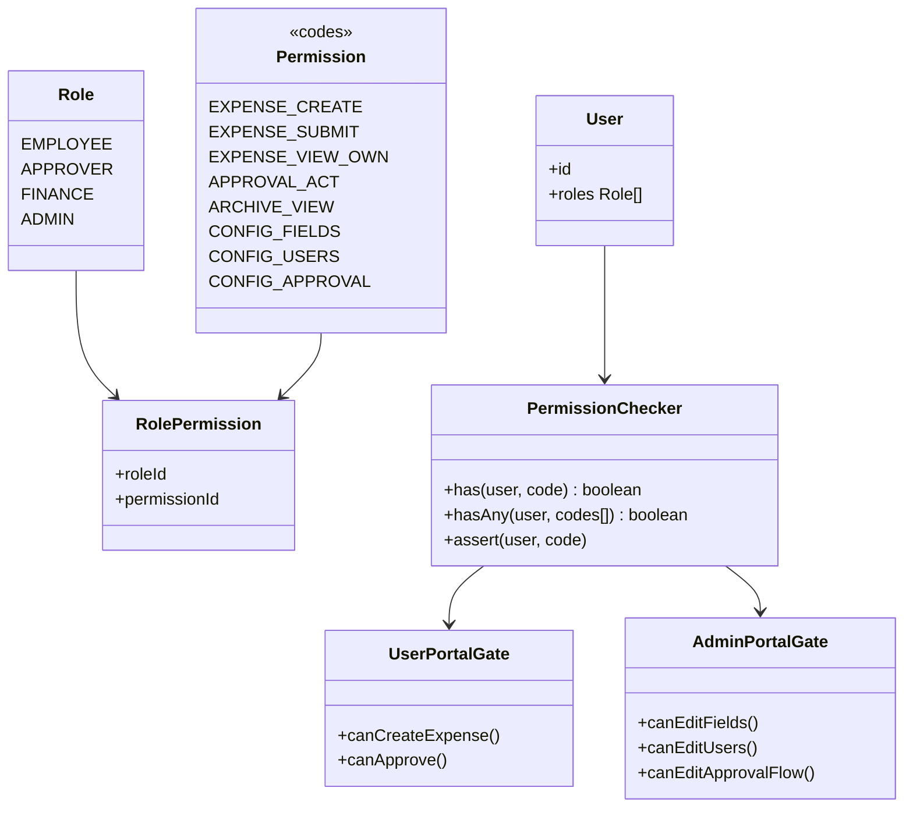

# 权限模型细节

典型映射：Employee→CREATE/SUBMIT；Approver→APPROVAL_ACT；Finance→APPROVAL_ACT+ARCHIVE；Admin→全部 CONFIG_*。

```mermaid
classDiagram
    direction TB

    class Permission {
        <<codes>>
        EXPENSE_CREATE
        EXPENSE_SUBMIT
        EXPENSE_VIEW_OWN
        APPROVAL_ACT
        ARCHIVE_VIEW
        CONFIG_FIELDS
        CONFIG_USERS
        CONFIG_APPROVAL
    }

    class Role {
        EMPLOYEE
        APPROVER
        FINANCE
        ADMIN
    }

    class RolePermission {
        +roleId
        +permissionId
    }

    class User {
        +id
        +roles Role[]
    }

    class PermissionChecker {
        +has(user, code) boolean
        +hasAny(user, codes[]) boolean
        +assert(user, code)
    }

    class UserPortalGate {
        +canCreateExpense()
        +canApprove()
    }

    class AdminPortalGate {
        +canEditFields()
        +canEditUsers()
        +canEditApprovalFlow()
    }

    Role --> RolePermission
    Permission --> RolePermission
    User --> PermissionChecker
    PermissionChecker --> UserPortalGate
    PermissionChecker --> AdminPortalGate
```
