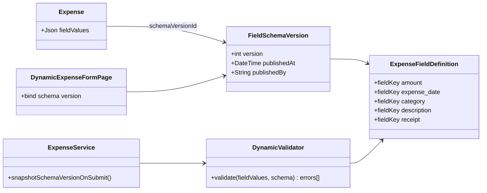

# 动态 Expense 字段

提交时锁定 `schemaVersionId`，避免 Admin 改字段后历史 expense 语义漂移；用户表单始终拉取**当前已发布** schema。

```mermaid
classDiagram
    direction LR

    class ExpenseFieldDefinition {
        +fieldKey amount
        +fieldKey expense_date
        +fieldKey category
        +fieldKey description
        +fieldKey receipt
    }

    class Expense {
        +Json fieldValues
    }

    class FieldSchemaVersion {
        +int version
        +DateTime publishedAt
        +String publishedBy
    }

    class DynamicValidator {
        +validate(fieldValues, schema) errors[]
    }

    class DynamicExpenseFormPage {
        +bind schema version
    }

    class ExpenseService {
        +snapshotSchemaVersionOnSubmit()
    }

    FieldSchemaVersion --> ExpenseFieldDefinition
    ExpenseService --> DynamicValidator
    DynamicValidator --> ExpenseFieldDefinition
    Expense --> FieldSchemaVersion : schemaVersionId
    DynamicExpenseFormPage --> FieldSchemaVersion
```
