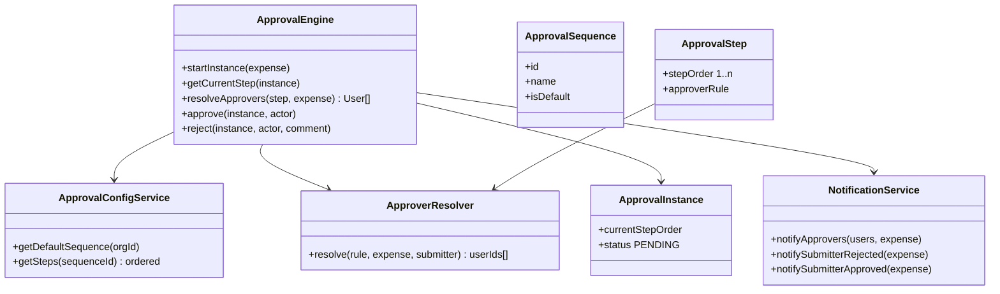

# 审核顺序引擎

按 `stepOrder` 串行推进：当前步骤全部 approve 后 `currentStepOrder++`；任一步 reject 则 expense→REJECTED 并通知提交人。

```mermaid
classDiagram
    direction TB

    class ApprovalConfigService {
        +getDefaultSequence(orgId)
        +getSteps(sequenceId) ordered
    }

    class ApprovalEngine {
        +startInstance(expense)
        +getCurrentStep(instance)
        +resolveApprovers(step, expense) User[]
        +approve(instance, actor)
        +reject(instance, actor, comment)
    }

    class ApprovalSequence {
        +id
        +name
        +isDefault
    }

    class ApprovalStep {
        +stepOrder 1..n
        +approverRule
    }

    class ApprovalInstance {
        +currentStepOrder
        +status PENDING
    }

    class ApproverResolver {
        +resolve(rule, expense, submitter) userIds[]
    }

    class NotificationService {
        +notifyApprovers(users, expense)
        +notifySubmitterRejected(expense)
        +notifySubmitterApproved(expense)
    }

    ApprovalEngine --> ApprovalConfigService
    ApprovalEngine --> ApproverResolver
    ApprovalEngine --> ApprovalInstance
    ApprovalEngine --> NotificationService
    ApprovalStep --> ApproverResolver
```
