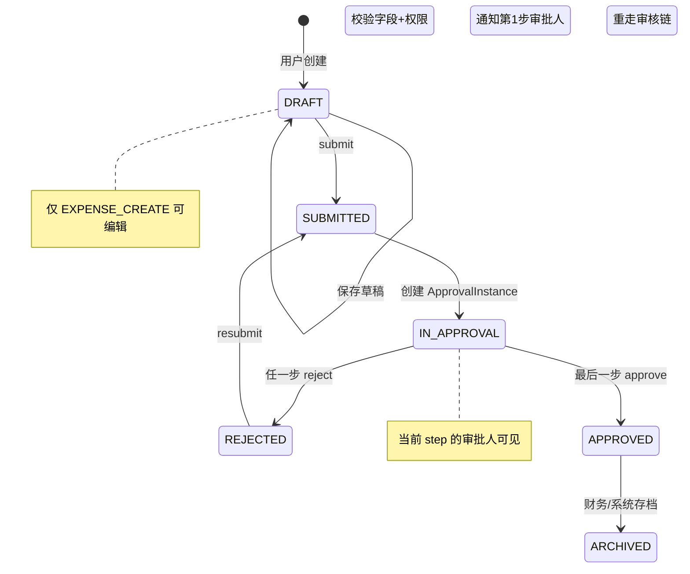

# Expense 状态机

用户侧 expense 生命周期；`IN_APPROVAL` 与 `ApprovalInstance` 同步。

```mermaid
stateDiagram-v2
    [*] --> DRAFT : 用户创建

    DRAFT --> DRAFT : 保存草稿
    DRAFT --> SUBMITTED : submit
校验字段+权限

    SUBMITTED --> IN_APPROVAL : 创建 ApprovalInstance
通知第1步审批人

    IN_APPROVAL --> REJECTED : 任一步 reject
    REJECTED --> SUBMITTED : resubmit
重走审核链

    IN_APPROVAL --> APPROVED : 最后一步 approve
    APPROVED --> ARCHIVED : 财务/系统存档

    note right of DRAFT
        仅 EXPENSE_CREATE 可编辑
    end note
    note right of IN_APPROVAL
        当前 step 的审批人可见
    end note
```
