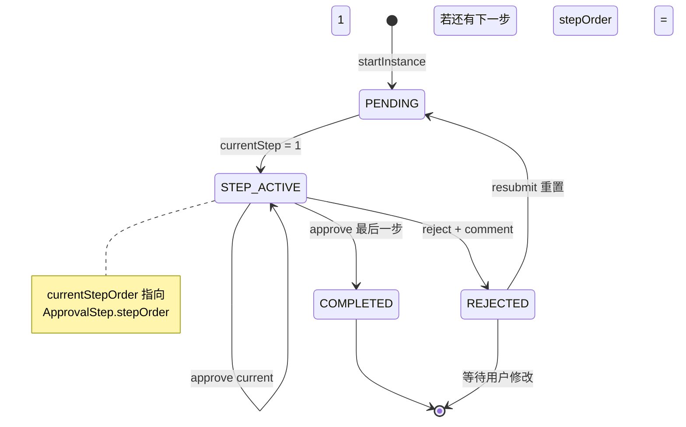

# ApprovalInstance 状态机

审批实例与 expense 状态联动；resubmit 时实例重置从第 1 步开始。

```mermaid
stateDiagram-v2
    [*] --> PENDING : startInstance

    PENDING --> STEP_ACTIVE : currentStep = 1
    STEP_ACTIVE --> STEP_ACTIVE : approve current
若还有下一步
    STEP_ACTIVE --> COMPLETED : approve 最后一步
    STEP_ACTIVE --> REJECTED : reject + comment

    REJECTED --> PENDING : resubmit 重置
stepOrder = 1
    COMPLETED --> [*]
    REJECTED --> [*] : 等待用户修改

    note right of STEP_ACTIVE
        currentStepOrder 指向
        ApprovalStep.stepOrder
    end note
```
