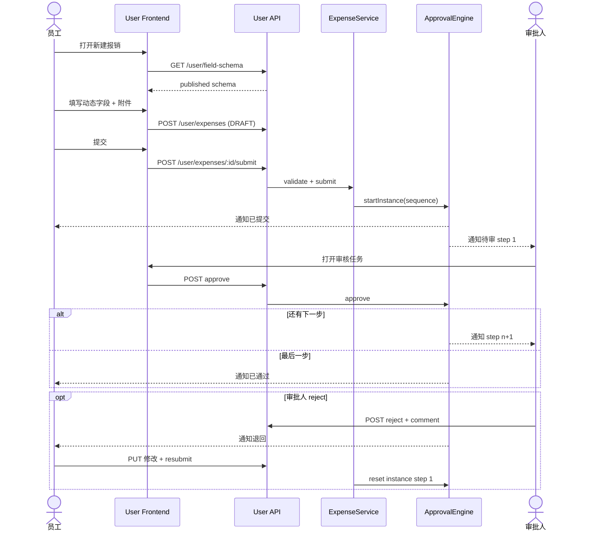

# 用户系统 · 端到端时序

从动态表单填报到多级审核、退回重提的完整用户系统时序。

```mermaid
sequenceDiagram
    actor Emp as 员工
    participant UFE as User Frontend
    participant API as User API
    participant ES as ExpenseService
    participant AE as ApprovalEngine
    actor Appr as 审批人

    Emp->>UFE: 打开新建报销
    UFE->>API: GET /user/field-schema
    API-->>UFE: published schema
    Emp->>UFE: 填写动态字段 + 附件
    UFE->>API: POST /user/expenses (DRAFT)
    Emp->>UFE: 提交
    UFE->>API: POST /user/expenses/:id/submit
    API->>ES: validate + submit
    ES->>AE: startInstance(sequence)
    AE-->>Emp: 通知已提交
    AE-->>Appr: 通知待审 step 1

    Appr->>UFE: 打开审核任务
    UFE->>API: POST approve
    API->>AE: approve
    alt 还有下一步
        AE-->>Appr: 通知 step n+1
    else 最后一步
        AE-->>Emp: 通知已通过
    end

    opt 审批人 reject
        Appr->>API: POST reject + comment
        AE-->>Emp: 通知退回
        Emp->>API: PUT 修改 + resubmit
        ES->>AE: reset instance step 1
    end
```
