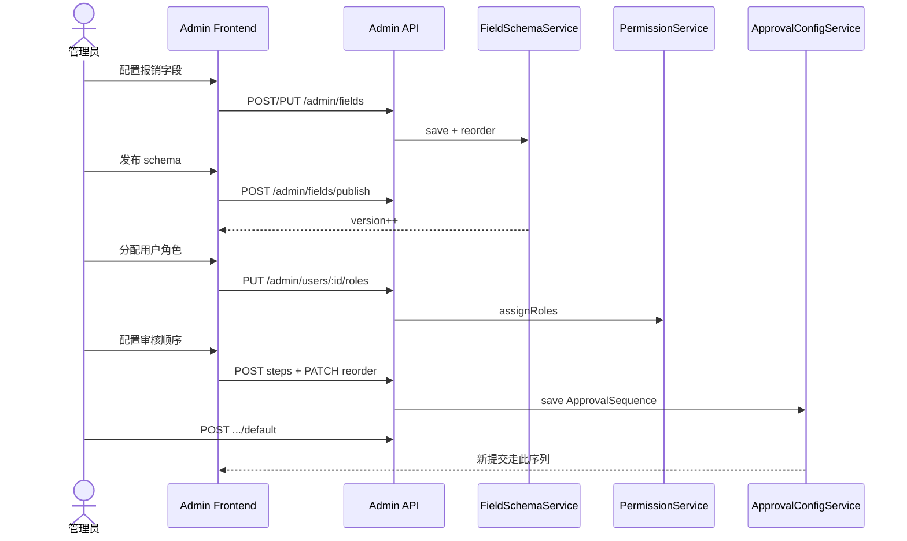

# Admin 系统 · 配置时序

Admin 配置生效顺序建议：先字段 → 再权限 → 再审核链；发布字段后用户表单即时更新。

```mermaid
sequenceDiagram
    actor Adm as 管理员
    participant AFE as Admin Frontend
    participant API as Admin API
    participant FS as FieldSchemaService
    participant PS as PermissionService
    participant AC as ApprovalConfigService

    Adm->>AFE: 配置报销字段
    AFE->>API: POST/PUT /admin/fields
    API->>FS: save + reorder
    Adm->>AFE: 发布 schema
    AFE->>API: POST /admin/fields/publish
    FS-->>AFE: version++ 

    Adm->>AFE: 分配用户角色
    AFE->>API: PUT /admin/users/:id/roles
    API->>PS: assignRoles

    Adm->>AFE: 配置审核顺序
    AFE->>API: POST steps + PATCH reorder
    API->>AC: save ApprovalSequence
    Adm->>API: POST .../default
    AC-->>AFE: 新提交走此序列
```
