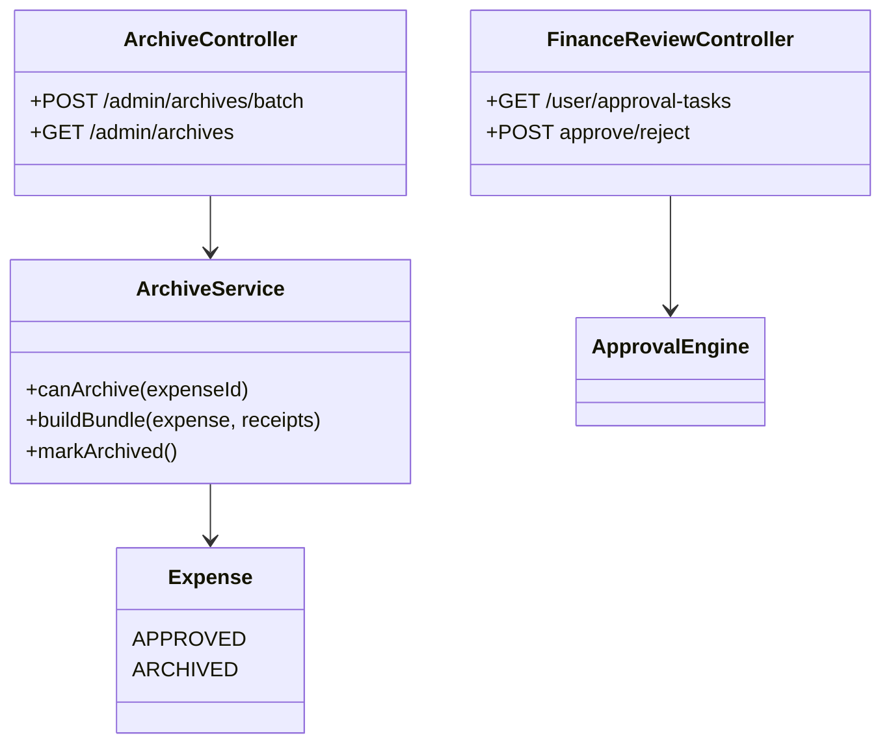

# 终审与存档

审核链最后一步常为 FINANCE 角色；全部 APPROVED 后由具备权限的 Admin/Finance 批量 archive。

```mermaid
classDiagram
    direction TB

    class FinanceReviewController {
        +GET /user/approval-tasks
        +POST approve/reject
    }

    class ArchiveController {
        +POST /admin/archives/batch
        +GET /admin/archives
    }

    class ArchiveService {
        +canArchive(expenseId)
        +buildBundle(expense, receipts)
        +markArchived()
    }

    class Expense {
        APPROVED
        ARCHIVED
    }

    FinanceReviewController --> ApprovalEngine
    ArchiveController --> ArchiveService
    ArchiveService --> Expense
```
