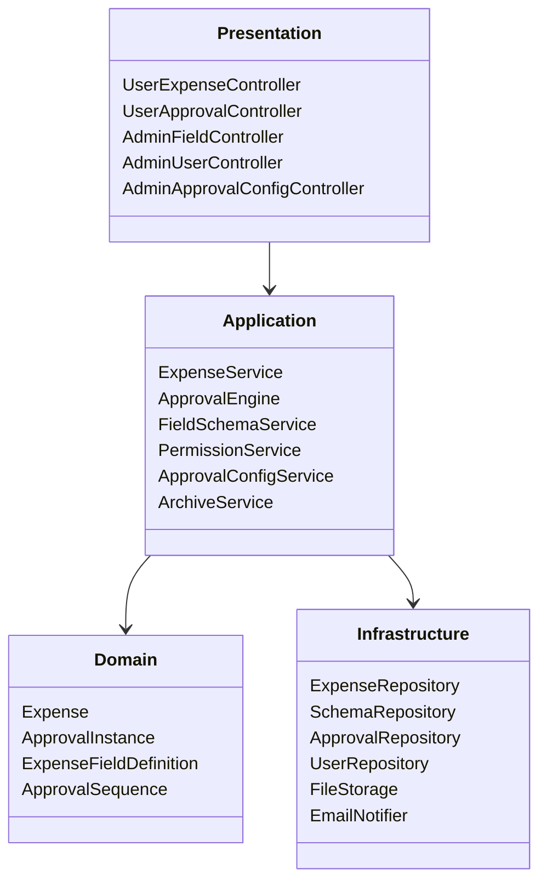

# 共享后端分层

六边形简化视图：Presentation 按 User/Admin 拆分，Domain 共享。

```mermaid
classDiagram
    direction TB

    class Presentation {
        UserExpenseController
        UserApprovalController
        AdminFieldController
        AdminUserController
        AdminApprovalConfigController
    }

    class Application {
        ExpenseService
        ApprovalEngine
        FieldSchemaService
        PermissionService
        ApprovalConfigService
        ArchiveService
    }

    class Domain {
        Expense
        ApprovalInstance
        ExpenseFieldDefinition
        ApprovalSequence
    }

    class Infrastructure {
        ExpenseRepository
        SchemaRepository
        ApprovalRepository
        UserRepository
        FileStorage
        EmailNotifier
    }

    Presentation --> Application
    Application --> Domain
    Application --> Infrastructure
```
