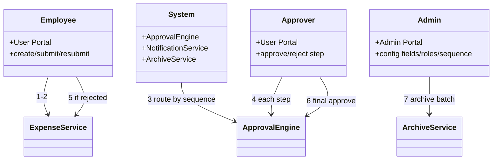

# 端到端参与方

三类人与系统协作：Admin 事前配置 → Employee 提交 → Approver 按序审核 → 存档。

```mermaid
classDiagram
    direction TB

    class Employee {
        +User Portal
        +create/submit/resubmit
    }

    class Approver {
        +User Portal
        +approve/reject step
    }

    class Admin {
        +Admin Portal
        +config fields/roles/sequence
    }

    class System {
        +ApprovalEngine
        +NotificationService
        +ArchiveService
    }

    Employee --> ExpenseService : 1-2
    System --> ApprovalEngine : 3 route by sequence
    Approver --> ApprovalEngine : 4 each step
    Employee --> ExpenseService : 5 if rejected
    Approver --> ApprovalEngine : 6 final approve
    Admin --> ArchiveService : 7 archive batch
```
