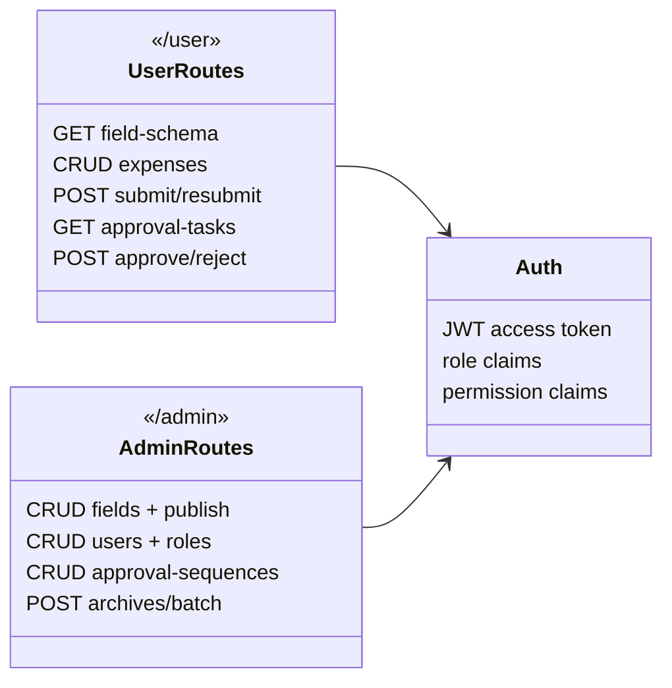

# API 路由总表

路由隔离：普通用户 token 无法访问 `/admin/*`；Admin token 可访问配置接口，默认不可代替他人填报 expense。

```mermaid
classDiagram
    direction LR

    class UserRoutes {
        <</user>>
        GET field-schema
        CRUD expenses
        POST submit/resubmit
        GET approval-tasks
        POST approve/reject
    }

    class AdminRoutes {
        <</admin>>
        CRUD fields + publish
        CRUD users + roles
        CRUD approval-sequences
        POST archives/batch
    }

    class Auth {
        JWT access token
        role claims
        permission claims
    }

    UserRoutes --> Auth
    AdminRoutes --> Auth
```
